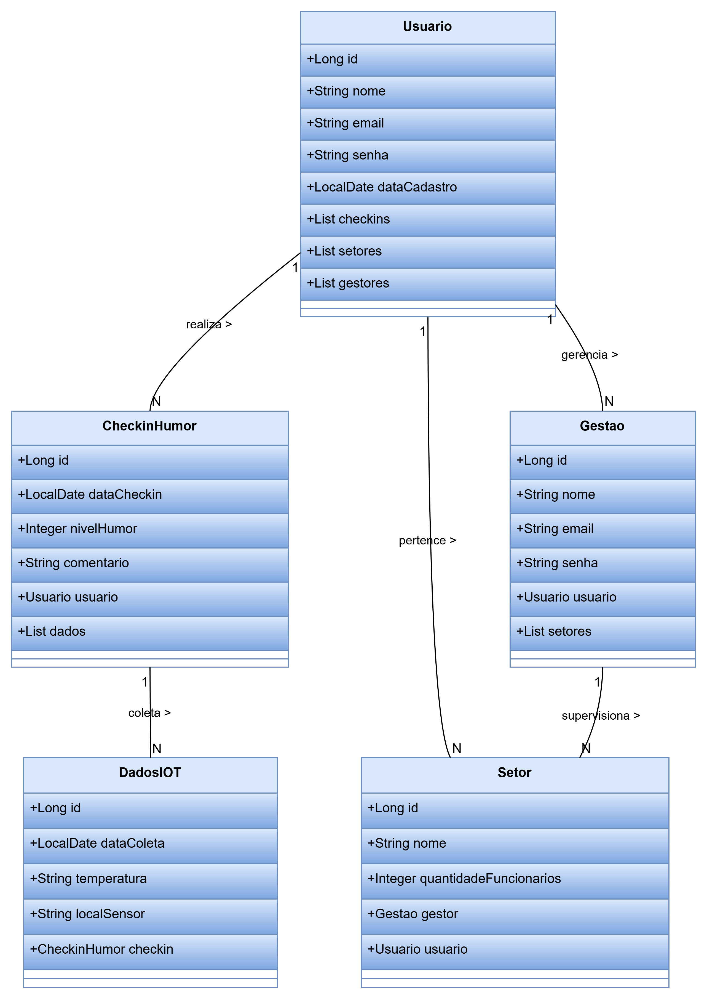
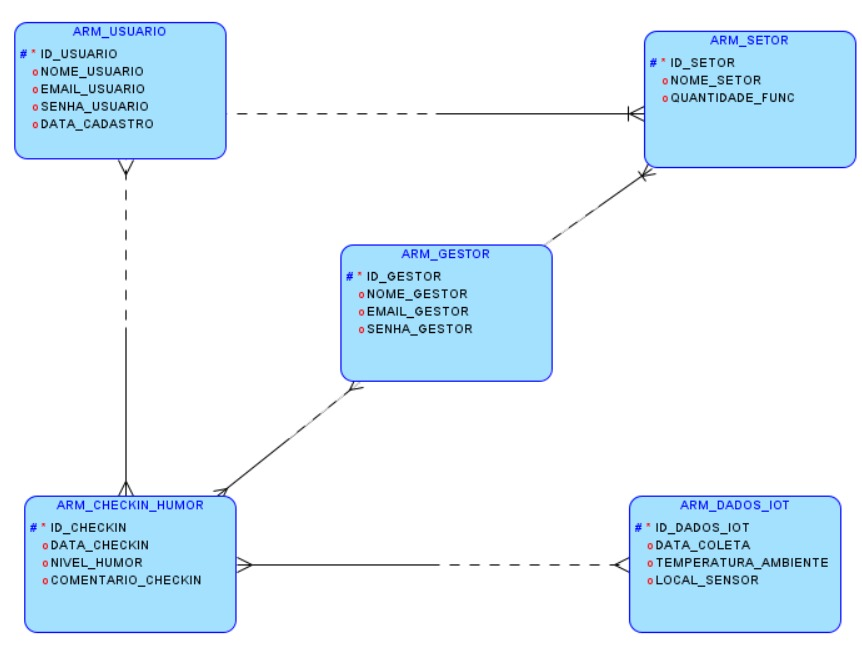

# 🏢 Wellsess - Sistema de Gestão de Bem-Estar Corporativo

<div align="center">


**Solução inovadora para monitoramento do bem-estar emocional no ambiente corporativo**

[▶️ **Assista ao Vídeo de Demonstração**](#) <!-- COLOCA O LINK DO VÍDEO AQUI -->

</div>

## 👥 Equipe

| RM | Nome | Função Principal |
|----|------|------------------|
| 560179 | Lucas da Ressurreição Barbosa | **Java Backend & IoT Integration** |
| 559210 | Ranaldo José da Silva | **DevOps, QA & Mobile** |
| 560694 | Fabrício José da Silva | **Oracle Database & .NET** |

## 🎯 Sobre o Projeto

O **Wellsess** é uma plataforma completa que permite às empresas monitorar e melhorar o bem-estar emocional de seus colaboradores através de check-ins regulares de humor integrados com dados de sensores IoT ambientais.

### 🚀 Diferenciais Técnicos
- **✅ Stored Procedures Oracle** para operações críticas
- **✅ Arquitetura em camadas** com DTOs e Services
- **✅ Validações robustas** com Bean Validation
- **✅ Paginação inteligente** onde faz sentido
- **✅ Documentação completa** com Swagger
- **✅ Relacionamentos JPA** otimizados


## 📊 Modelo de Domínio

### Diagrama de Classes de Entidade
<!-- COLOCA A IMAGEM DO DIAGRAMA DE CLASSES AQUI -->
 

### Diagrama Entidade-Relacionamento (DER)
<!-- COLOCA A IMAGEM DO DER AQUI -->
 <!-- AJUSTA O CAMINHO -->

## 🗂️ Estrutura do Projeto
```bash
src/
├── main/
│   ├── java/
│   │   └── br/com/fiap/Wellsess/
│   │       ├── config/          # Swagger, Security
│   │       ├── controller/      # REST Controllers  
│   │       ├── dto/            # Request/Response DTOs
│   │       ├── entity/         # JPA Entities
│   │       ├── repository/     # JPA Repositories + Procedures
│   │       ├── service/        # Business Logic
│   └── resources/
│       └── application.properties
```


## 🚀 Como Executar

### Pré-requisitos
- Java 17+
- Oracle Database
- Gradle

### Execução Local
```bash
# Clone o repositório
git clone [seu-repositorio]

# Configure as variáveis de ambiente
export DB_URL=jdbc:oracle:thin:@localhost:1521:XE
export DB_USER=wellsess
export DB_PASS=password

# Execute a aplicação
./gradlew bootRun
```
## 📚 Documentação

### Swagger UI
Acesse a documentação interativa da API:  
**🔗 [Swagger UI](http://localhost:8080/swagger-ui.html)**

### API Docs (JSON)
Documentação em formato OpenAPI:  
**🔗 [API Docs](http://localhost:8080/api-docs)**

## 📡 Endpoints Principais

| Método | Endpoint | Descrição | Status |
|--------|----------|-----------|---------|
| `GET` | `/api/usuarios` | Lista usuários com **paginação** | ✅ |
| `POST` | `/api/usuarios` | Cria usuário via **procedure** | ✅ |
| `GET` | `/api/usuarios/{id}` | Busca usuário por ID | ✅ |
| `PUT` | `/api/usuarios/{id}` | Atualiza usuário | ✅ |
| `DELETE` | `/api/usuarios/{id}` | Remove usuário | ✅ |
| `GET` | `/api/checkins` | Lista checkins de humor | ✅ |
| `POST` | `/api/checkins` | Cria checkin via **procedure** | ✅ |
| `GET` | `/api/checkins/usuario/{id}` | Checkins por usuário | ✅ |
| `GET` | `/api/gestores` | Lista gestores | ✅ |
| `POST` | `/api/gestores` | Cria gestor via **procedure** | ✅ |
| `GET` | `/api/setores` | Lista setores | ✅ |
| `POST` | `/api/setores` | Cria setor via **procedure** | ✅ |
| `GET` | `/api/dados-iot` | Lista dados IoT | ✅ |
| `POST` | `/api/dados-iot` | Cria dados IoT via **procedure** | ✅ |

## 🛠️ Stack Tecnológica

### **Backend**
- **Spring Boot 3.2** - Framework principal
- **Spring Data JPA** - Persistência de dados
- **Bean Validation** - Validações de entrada
- **Spring Web** - API REST

### **Banco de Dados**
- **Oracle Database** - Banco relacional
- **Stored Procedures** - Operações de insert
- **JPA/Hibernate** - Mapeamento ORM

### **Documentação & Qualidade**
- **Swagger/OpenAPI 3.0** - Documentação interativa
- **Gradle** - Gerenciamento de dependências
- **JUnit & Mockito** - Testes unitários

### **Arquitetura**
- **Padrão MVC** - Separação de concerns
- **DTO Pattern** - Transferência de dados
- **Repository Pattern** - Abstração de dados